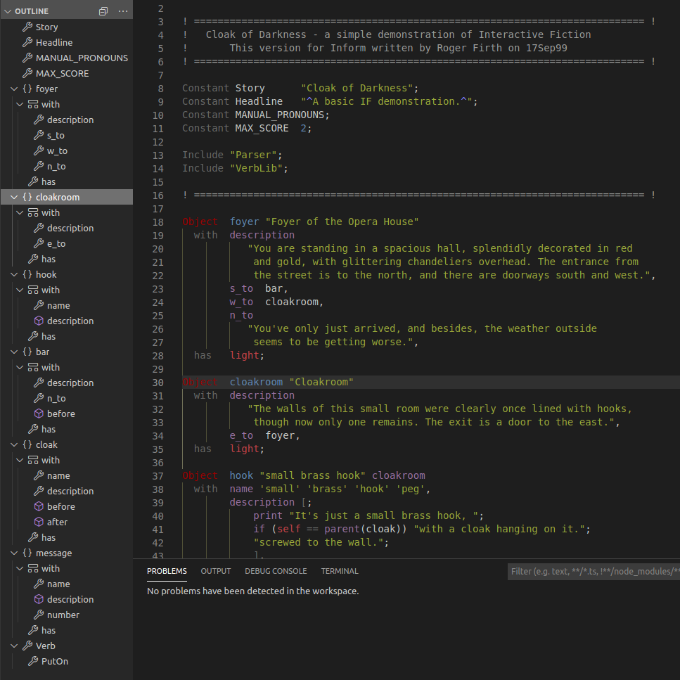

# inf6langtools

Inform 6 extension is a client for the ls4Inform Language Server that provides language utilities such as outliner, cross-reference etc. It is powered by the XText Framework.




## Features 

The extension is bundled with an LSP implementation written in Java (with XText) that can be used with any editor supporting the Language Server Protocol 
Source code at: https://github.com/toerob/ls4inform6
 * Outliner with all objects 
 * Go to reference and find all references between included files via class name, direction properties (n_to, s_to etc) and attributes
 * Code syntax checks with warnings on wrongly typed object definitions.

 

## Installation

* Install java, Java 10 or higher (either JRE/JDK will do). Any implementation of the JVM  would do, some suggestions are: Open JDK, Azul Zulu, or Oracle. If your system is linux or mac I highly suggest installing https://sdkman.io/ for installing and switching between different java versions.

* Set the JAVA_HOME environment variable to point to the root folder of your installed java version. If running sdkman this will be the equivalent of:

  ```bash
  JAVA_HOME=/home/<user>/.sdkman/candidates/java/current 
  ```

* if not installed already search for the extension in the vscode extension pane: "inf6langtools" and install it. 

  

  (_OR_ do a manual installation like this:

 * Download the file https://github.com/toerob/inf6langtools/blob/master/inf6langtools-0.1.0-alpha.vsix
 * Install the plugin by opening the extension pane to the left, select the top bar menu button (...) and choose "Install from VSIX..."
 * Select the downloaded file and you are good to go)

## Basic setup

Library folders (or any unexplicit include directives) will need to be referenced via comments with the compiler directive "include_path" or "language" at the top of the source file, the same way done in inform source files, e.g:

```inform
!% +include_path=../../lib/,/usr/local/share/inform/lib/
```

(The search paths can be both relative or absolute but cannot have any spaces separating them.)

Without the necessary references being set this way, you might see a lot of errors in the "problems" window of vscode as the server cannot find do a proper cross-referencing between the files for symbols it cannot find in the current file but should be able to find in included files.


## Disclaimer

This is not a fully featured language server yet. It is more or less an outliner in its current state, with additional bonus features such as cross-references.

## Requirements

* Java 10 or higher 

## Troubleshooting

* To rule out java installtion problems you could try to download https://github.com/toerob/inf6langtools/blob/master/launcher/launcher.jar (also included in this extension) and try running the jar directly at the terminal inside vscode with the command "java -jar launcher.jar" It should just start silently with no errors.  You can then kill the process with "ctrl-c". If that works you should be good to go.

## License and credit
The language Server for Inform 6 (bundled with this client and with source code available at: https://github.com/toerob/ls4inform6) is powered by the XText framework (https://www.eclipse.org/Xtext/index.html) licensed under the EPL 2.0 license (https://www.eclipse.org/legal/epl-2.0/). 

## Extension Settings

## Known Issues

## Release Notes

### 0.1.0
This is an alpha release made purely for the sake of it might already be useful to the IF community at the present stage. 

